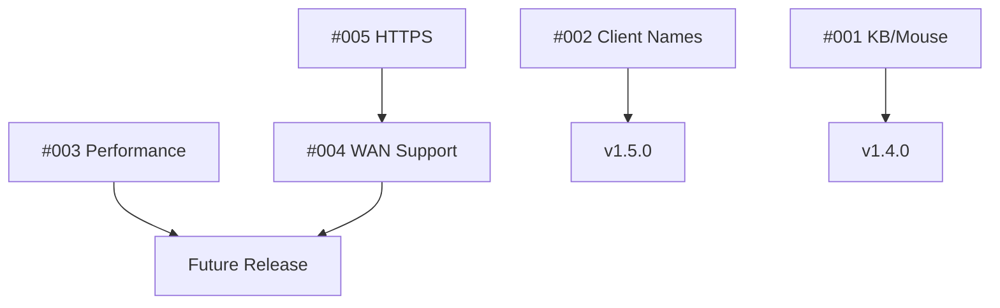

# Open Issues in Issue-Tracking Branch

## Critical Priority
1. [#003] Performance Optimization: Reduce Lag
   - Optimize screen capture and frame handling
   - Improve network communication
   - Reduce resource usage
   - Target: <50ms latency, 30+ FPS

2. [#004] WAN Support: Enable Internet Access
   - NAT traversal and connection management
   - Security implementation
   - User experience improvements
   - Status: Planning Phase

3. [#005] HTTPS Support: Secure Communication
   - Certificate management
   - Security configuration
   - Server setup
   - Status: Planning Phase

## High Priority
1. [#002] Client Name Display
   - ✅ Implemented in v1.5.0
   - Status: Resolved

## Medium Priority
1. [#001] Keyboard and Mouse Control
   - ✅ Implemented in v1.4.0
   - Status: Resolved

## Issue Dependencies

## Development Timeline
1. Current Focus (v1.5.0)
   - Client name feature ✅
   - Issue tracking system ✅

2. Next Phase
   - Performance optimization (#003)
   - HTTPS support (#005)
   - WAN support (#004)

## Branch Status
- Branch: `issue-tracking`
- Latest Version: v1.5.0
- Open Issues: 3
- Closed Issues: 2
